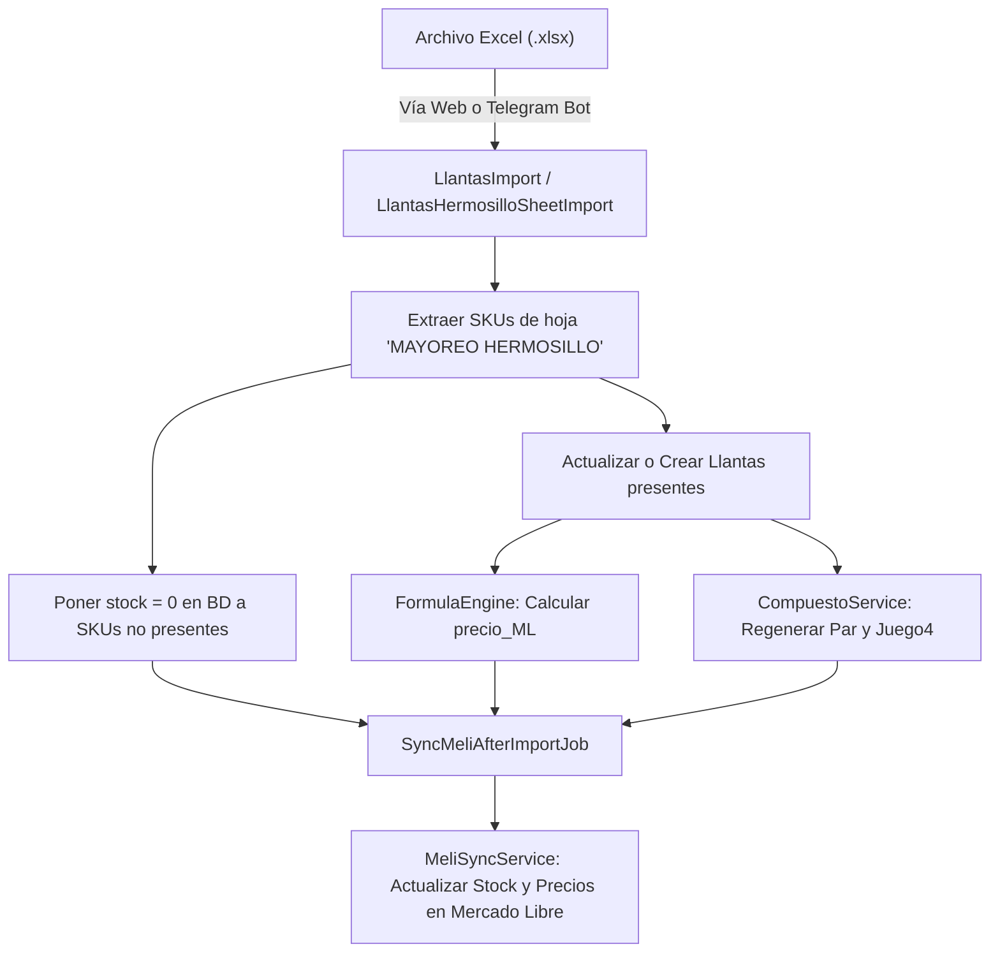
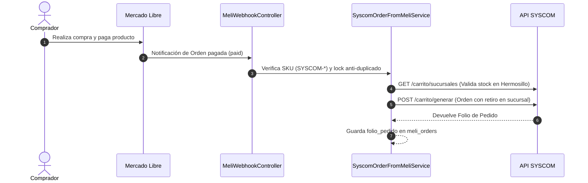
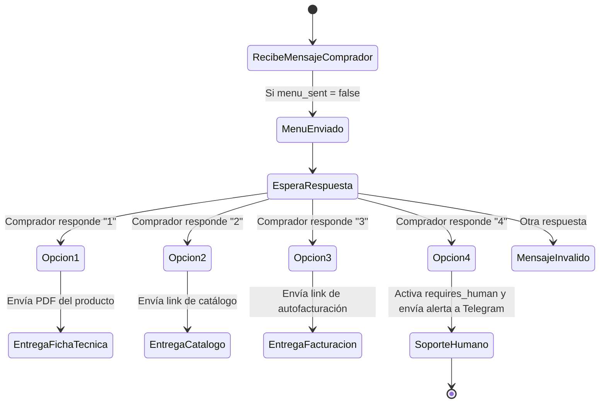

# Análisis Integral de Arquitectura y Componentes del Sistema: `api-llantas`

> **Documento de Especificación y Análisis Técnico**  
> **Ubicación:** `api-llantas`  
> **Fecha de Análisis:** Septiembre 2026  
> **Versión Framework:** Laravel 12.x (PHP 8.2+) / Inertia.js 2.x / React 19 / Tailwind CSS 4

---

## 1. Resumen Ejecutivo y Propósito del Proyecto

El proyecto **`api-llantas`** es una plataforma empresarial híbrida de comercio electrónico, automatización logística, sincronización multicanal y dropshipping B2B.

Aunque su nombre original proviene del rubro de neumáticos (*llantas*), la plataforma ha evolucionado para convertirse en un **orquestador centralizado omnicanal** que integra de forma simultánea:
1. **Llantas y Paquetes Compuestos:** Importación masiva de inventarios vía Excel/Telegram, tarificación dinámica mediante fórmulas matemáticas sin `eval()`, generación automática de paquetes (par, juego de 4) y sincronización con Mercado Libre.
2. **Dropshipping y Sincronización B2B con SYSCOM:** Integración profunda con la API y portal de SYSCOM (sucursal Hermosillo), cálculo de rentabilidad con retenciones fiscales SAT (ISR/IVA) y comisiones de Mercado Libre, normalización de imágenes a estándares de MeLi (1200×1200px con fondo blanco y proporción del 92%), publicación en 1-clic y creación automatizada de pedidos de compra (`POST /carrito/generar`) ante ventas concretadas.
3. **Módulo Logístico AMS (Fulfillment & Colecta Mercado Envíos):** Procesamiento de envíos por ventana horaria de corte de colecta, exclusión de pedidos despachados, e impresión directa de etiquetas térmicas de envío (ZPL / PDF).
4. **Chatbot Posventa Automatizado para Mercado Libre:** Bot conversacional por mensajería posventa guiado por opciones interactivas (1: Ficha técnica, 2: Catálogo general, 3: Portal de autofacturación, 4: Transferencia a soporte humano con alertas a Telegram).
5. **Bot de Automatización en Telegram:** Recepción de archivos Excel por mensaje directo para actualizar inventarios y precios en segundo plano sin entrar al panel web.
6. **Catálogo BeautyShop & Mapeo Taxonómico con Shopify:** Sincronización de productos desde Mercado Libre hacia Shopify, incluyendo un motor heurístico y semántico que resuelve categorías oficiales de la taxonomía de Shopify (`TaxonomyCategory`) para productos de cuidado personal, cosmética y mobiliario de estética.

---

## 2. Arquitectura General y Tecnologías

### 2.1 Backend
- **Laravel 12 (PHP ^8.2):** Framework backend moderno configurado con estructura modular (`bootstrap/app.php`, `routes/web.php`, `routes/api.php`, `routes/console.php`).
- **Laravel Fortify:** Autenticación de usuarios, reseteo de contraseñas, confirmación de credenciales y autenticación de dos factores (2FA / Google Authenticator).
- **Laravel Sanctum:** Autenticación basada en tokens para APIs.
- **Maatwebsite Excel 3.1:** Procesamiento y lectura de archivos Excel (`.xlsx`, `.xls`) en hojas específicas ("MAYOREO HERMOSILLO").
- **GuzzleHttp con Pool Concurrente:** Llamadas HTTP asíncronas concurrentes con control de concurrencia (8 hilos en paralelo) para sincronizar masivamente stock y precios en la API de Mercado Libre.
- **OpenAI PHP Client:** Soporte para resolución semántica de taxonomías.

### 2.2 Frontend
- **Inertia.js v2.0:** Arquitectura monolítica moderna (Server-Driven) conectando Laravel con React sin API REST intermedia.
- **React 19 & React-DOM 19:** Componentes funcionales e interactivos, gestión de estado y renderizado rápido.
- **Tailwind CSS v4 & @tailwindcss/vite:** Estilizado moderno, reactivo y utilitario.
- **Vite 6:** Empaquetador de activos ultrarrápido con soporte para JSX y recarga en caliente (HMR).

### 2.3 Servicios Externos Integrados
- **Mercado Libre API:** OAuth 2.0 (tokens y refresh tokens automáticos), Items, Publications, Orders, Shipments, Packs y Post-Sale Messaging.
- **SYSCOM Developer API v1 & Web Portal Scraping:** Autenticación Client Credentials, catálogo filtrado por sucursal Hermosillo, conversión cambiaria USD/MXN con tipo de cambio preferencial, compras en carrito y scraper de disponibilidad por sucursal con sesión web.
- **Shopify Admin GraphQL API:** Catálogo y taxonomía de productos.
- **Telegram Bot API:** Recepción de documentos Excel vía Webhook seguro y notificaciones push al equipo de operaciones.

---

## 3. Mapa de Estructura del Código Fuente

```
api-llantas/
├── app/
│   ├── Actions/Fortify/          # Lógica de registro, passwords y 2FA
│   ├── Console/Commands/         # 24 comandos Artisan personalizados
│   ├── Http/
│   │   ├── Controllers/          # 18 controladores (Web, API y Settings)
│   │   └── Middleware/           # HandleInertiaRequests (props compartidas)
│   ├── Imports/                  # Clases de importación Excel (Llantas)
│   ├── Jobs/                     # 9 tareas asíncronas encoladas
│   ├── Models/                   # 11 modelos Eloquent ORM
│   ├── Providers/                # Service Providers (App, Auth, Fortify, Volt)
│   ├── Services/                 # 24 servicios de lógica de negocio y APIs
│   └── Support/                  # 8 helpers y utilidades auxiliares
├── config/                       # Archivos de configuración (ams_colecta, syscom, meli_menu, etc.)
├── database/
│   ├── migrations/               # Migraciones de base de datos
│   └── seeders/
├── resources/
│   ├── js/
│   │   ├── Components/           # Layout AppShell, menú de usuario, toasts
│   │   └── Pages/                # Vistas React (Ams, Dashboard, Llantas, Syscom, PriceRules, etc.)
├── routes/
│   ├── web.php                   # Rutas web autenticadas bajo Inertia
│   ├── api.php                   # Webhooks públicos (Telegram, MeLi, Chat MeLi)
│   └── console.php               # Tareas programadas del Cron (Scheduler)
└── storage/                      # Almacenamiento local, logs y descargas temporales
```

---

## 4. Desglose Detallado por Subsistemas y Componentes

### 4.1 Subsistema de Llantas y Paquetes Compuestos

#### 4.1.1 Modelos de Datos
- **[`Llanta`](file:///c:/Users/TUF%20GAMING/OneDrive/Escritorio/Gianini/BeautyShop/api-llantas/app/Models/Llanta.php):**
  - Campos: `sku`, `marca`, `medida`, `descripcion`, `costo`, `precio_ML`, `title_familyname`, `MLM`, `stock`, `price_mode` (`auto` o `manual`), `last_import_at`, `official_store_id`.
  - Relaciones: `hasMany(ProductoCompuesto)`, `hasMany(MeliPublication)`, `latestMeliPublication()`.
  - Atributos calculados: `precio_ml_real`, `costo_real`, `titulo_real`.
- **[`ProductoCompuesto`](file:///c:/Users/TUF%20GAMING/OneDrive/Escritorio/Gianini/BeautyShop/api-llantas/app/Models/ProductoCompuesto.php):**
  - Campos: `llanta_id`, `sku` (ej. `SKU-2` o `SKU-4`), `tipo` (`par` o `juego4`), `stock`, `descripcion`, `title_familyname`, `costo`, `precio_ML`, `MLM`, `price_mode`.
  - Relación: `belongsTo(Llanta)`.

#### 4.1.2 Servicios de Soporte
- **[`BrandDetector`](file:///c:/Users/TUF%20GAMING/OneDrive/Escritorio/Gianini/BeautyShop/api-llantas/app/Services/BrandDetector.php):**
  - Detecta marcas desde cadenas de texto libre o descripciones.
  - Ordena el diccionario de marcas por longitud descendente para dar prioridad a nombres compuestos (ej. `COOPER TIRES` antes que `COOPER`, `GENERAL TIRE`, `GUTE ROAD`, `JK TYRE`).
  - Normaliza sinónimos como `GOOD YEAR` -> `GOODYEAR` y más de 80 marcas automotrices.
- **[`TitleGenerator`](file:///c:/Users/TUF%20GAMING/OneDrive/Escritorio/Gianini/BeautyShop/api-llantas/app/Services/TitleGenerator.php):**
  - Genera títulos normalizados optimizados para el algoritmo de búsqueda de Mercado Libre:
    - Pieza unitaria: `LLANTA <MEDIDA> <MARCA> <DESCRIPCION>`
    - Paquetes: `2 PACK DE LLANTAS <MEDIDA> <MARCA> <DESCRIPCION>` o `4 PACK DE LLANTAS ...`
- **[`CompuestoService`](file:///c:/Users/TUF%20GAMING/OneDrive/Escritorio/Gianini/BeautyShop/api-llantas/app/Services/CompuestoService.php):**
  - Genera y actualiza automáticamente las variantes de 2 (`par`, factor multiplicador 1.40x) y 4 unidades (`juego4`, factor multiplicador 1.35x).
  - Respeta el precio manual si el usuario bloqueó el modo de precio (`price_mode = manual`).
  - Mantiene intacta la columna `MLM` para no romper la vinculación con MeLi.

#### 4.1.3 Importación Masiva (Excel & Background Jobs)
- **[`LlantasImport`](file:///c:/Users/TUF%20GAMING/OneDrive/Escritorio/Gianini/BeautyShop/api-llantas/app/Imports/LlantasImport.php) & [`LlantasHermosilloSheetImport`](file:///c:/Users/TUF%20GAMING/OneDrive/Escritorio/Gianini/BeautyShop/api-llantas/app/Imports/LlantasHermosilloSheetImport.php):**
  - Lee exclusivamente la pestaña `"MAYOREO HERMOSILLO"`.
  - Busca dinámicamente la fila de cabecera (`codigo`/`código`).
  - **Puesta a cero inteligente:** Identifica todos los SKUs que no vienen en el nuevo archivo y actualiza masivamente su stock a `0`, dejando registrado el timestamp `last_import_at`.
  - Realiza un `updateOrCreate` de cada llanta detectando medida (vía regex `\d{3}/\d{2}R\d{2}`) y marca.
  - Aplica la fórmula de precio correspondiente según `PriceRule`.
  - Al concluir, encola el job `SyncMeliAfterImportJob` para refrescar de inmediato Mercado Libre.

---

### 4.2 Motor de Fórmulas y Reglas de Precio Dinámicas

- **[`PriceRule`](file:///c:/Users/TUF%20GAMING/OneDrive/Escritorio/Gianini/BeautyShop/api-llantas/app/Models/PriceRule.php):**
  - Almacena reglas configurables divididas por:
    - `rule_set`: `llantas` o `syscom`.
    - `scope`: `llanta`, `par`, `juego4` o general.
    - `formula`: Expresión matemática en texto (ej. `(costo * 1.16) * 1.30 + 150`).
- **[`FormulaEngine`](file:///c:/Users/TUF%20GAMING/OneDrive/Escritorio/Gianini/BeautyShop/api-llantas/app/Services/FormulaEngine.php):**
  - Evaluador matemático seguro que **no utiliza la función vulnerable `eval()`**.
  - Implementa el algoritmo de **Shunting-Yard (Notación Polaca Inversa / RPN)** con validación estricta de tokens permitidos (`+`, `-`, `*`, `/`, paréntesis y variables como `costo`, `piezas`).
  - Control de divisiones entre cero y validación de sintaxis antes de guardar.
- **[`PriceRulesController`](file:///c:/Users/TUF%20GAMING/OneDrive/Escritorio/Gianini/BeautyShop/api-llantas/app/Http/Controllers/PriceRulesController.php):**
  - Permite visualizar, modificar y probar fórmulas en tiempo real (`POST /price-rules/test`) desde la vista React [`PriceRules/Index.jsx`](file:///c:/Users/TUF%20GAMING/OneDrive/Escritorio/Gianini/BeautyShop/api-llantas/resources/js/Pages/PriceRules/Index.jsx).

---

### 4.3 Integración con Mercado Libre (Publicación, Sincronización y Comparador)

#### 4.3.1 Autenticación y Conectividad
- **[`MeliAccount`](file:///c:/Users/TUF%20GAMING/OneDrive/Escritorio/Gianini/BeautyShop/api-llantas/app/Models/MeliAccount.php) & [`MeliOAuthService`](file:///c:/Users/TUF%20GAMING/OneDrive/Escritorio/Gianini/BeautyShop/api-llantas/app/Services/MeliOAuthService.php):**
  - Flujo OAuth 2.0 (`/auth/meli` y `/auth/meli/callback`).
  - Renovación de access token antes de expirar (comando `meli:refresh-token` cada 10 min en cron).
  - Manejo de reintentos transparentes cuando MeLi responde con `HTTP 401 Unauthorized`.
- **[`MeliApi`](file:///c:/Users/TUF%20GAMING/OneDrive/Escritorio/Gianini/BeautyShop/api-llantas/app/Services/MeliApi.php):**
  - Cliente base para consultar órdenes, packs, ítems y recursos de mensajería posventa.

#### 4.3.2 Sincronización Masiva de Stock y Precios
- **[`MeliSyncService`](file:///c:/Users/TUF%20GAMING/OneDrive/Escritorio/Gianini/BeautyShop/api-llantas/app/Services/MeliSyncService.php):**
  - Sincroniza en lotes concurrentes (vía `GuzzleHttp\Pool` con concurrencia de 8 hilos) las tres ramas de productos:
    1. Llantas individuales.
    2. Productos compuestos (pares y juegos de 4).
    3. Publicaciones de catálogo SYSCOM.
  - **Optimización No-Op:** Si los valores de stock y precio locales coinciden exactamente con los almacenados en `raw` de `MeliPublication`, omite el `PUT` a la API para no gastar rate-limit de MeLi.
  - **Pausado / Reactivación Automática:**
    - Pausa publicaciones si el stock local cae a 1 o 0 para evitar cancelaciones operativas y penalizaciones en la reputación.
    - Reactiva automáticamente (`status: active`) cuando vuelve a haber stock.

#### 4.3.3 Publicación y Republicación
- **[`MeliPublishService`](file:///c:/Users/TUF%20GAMING/OneDrive/Escritorio/Gianini/BeautyShop/api-llantas/app/Services/MeliPublishService.php) & [`MeliRepublishService`](file:///c:/Users/TUF%20GAMING/OneDrive/Escritorio/Gianini/BeautyShop/api-llantas/app/Services/MeliRepublishService.php):**
  - Sugerencia de categorías mediante predictor de dominios de MeLi.
  - Extracción de atributos obligatorios requeridos por cada categoría de MeLi.
  - Creación de publicaciones nuevas vinculando el `seller_custom_field` al SKU local.
  - Republicación de productos pausados, cerrados o bloqueados por moderación conservando historial.

#### 4.3.4 Comparador de Catálogo MeLi vs. Local
- **[`MeliCompareController`](file:///c:/Users/TUF%20GAMING/OneDrive/Escritorio/Gianini/BeautyShop/api-llantas/app/Http/Controllers/MeliCompareController.php) & [`RunMeliCompareSync`](file:///c:/Users/TUF%20GAMING/OneDrive/Escritorio/Gianini/BeautyShop/api-llantas/app/Jobs/RunMeliCompareSync.php):**
  - Escanea todo el catálogo activo de la cuenta de Mercado Libre del vendedor.
  - Cruza contra la base de datos local y detecta:
    - Desfases de precio (precio publicado en MeLi vs. precio calculado en sistema).
    - Desfases de existencias (stock en MeLi vs. inventario en almacén).
    - Publicaciones huérfanas en MeLi sin registro en el sistema local.
  - Renderizado interactivo en la vista [`Ml/Compare.jsx`](file:///c:/Users/TUF%20GAMING/OneDrive/Escritorio/Gianini/BeautyShop/api-llantas/resources/js/Pages/Ml/Compare.jsx).

---

### 4.4 Módulo Logístico y Fulfillment: AMS Pedidos

- **[`MeliOrder`](file:///c:/Users/TUF%20GAMING/OneDrive/Escritorio/Gianini/BeautyShop/api-llantas/app/Models/MeliOrder.php) & [`MeliOrderItem`](file:///c:/Users/TUF%20GAMING/OneDrive/Escritorio/Gianini/BeautyShop/api-llantas/app/Models/MeliOrderItem.php):**
  - Modelo central de órdenes de Mercado Libre, estados de envío (`shipping_status`, `shipping_substatus`, `shipping_logistic_type`), fecha de procesamiento y tracking.
- **[`AmsPedidosController`](file:///c:/Users/TUF%20GAMING/OneDrive/Escritorio/Gianini/BeautyShop/api-llantas/app/Http/Controllers/AmsPedidosController.php):**
  - **Pedidos del Día (`/ams/pedidos`):** Muestra el resumen de ventas del día actual con totales de unidades e ingresos.
  - **Pedidos por Procesar (`/ams/pedidos-procesar`):**
    - Aplica filtros de ventana horaria configurados en [`config/ams_colecta.php`](file:///c:/Users/TUF%20GAMING/OneDrive/Escritorio/Gianini/BeautyShop/api-llantas/config/ams_colecta.php) (desde las 12:00 del día anterior hasta las 10:32 del día actual).
    - Filtra órdenes cuyo envío esté listo para despachar (`ready_to_print`, `printed`).
    - Excluye órdenes que ya fueron entregadas a la colecta o que están en camino (`picked_up`, `shipped`, `in_transit`).
  - **Pedidos para Mañana (`/ams/pedidos-manana`):** Agrupa ventas que entraron después de la hora de corte para preparar el lote del día siguiente.
  - **Impresión de Etiquetas (`/ams/pedidos/shipping-label/{shippingId}`):**
    - Descarga el contenido binario de la etiqueta de Mercado Envíos y lo entrega directamente en formato PDF/ZPL para impresoras térmicas (Zebra, etc.).
- **[`AmsMarcaPedidos`](file:///c:/Users/TUF%20GAMING/OneDrive/Escritorio/Gianini/BeautyShop/api-llantas/app/Support/AmsMarcaPedidos.php):**
  - Agrupa pedidos por marca física de llanta para optimizar la recolección en los racks del almacén.

---

### 4.5 Chatbot de Atención Posventa y Mensajería Mercado Libre

- **[`MeliChatFlow`](file:///c:/Users/TUF%20GAMING/OneDrive/Escritorio/Gianini/BeautyShop/api-llantas/app/Models/MeliChatFlow.php):**
  - Máquina de estados conversacional asociada a una orden/comprador.
  - Campos: `order_id`, `buyer_id`, `menu_sent`, `last_option_selected`, `requires_human`, `product_pdf_url`, `catalog_pdf_url`, `invoice_url`.
- **[`MeliChatWebhookController`](file:///c:/Users/TUF%20GAMING/OneDrive/Escritorio/Gianini/BeautyShop/api-llantas/app/Http/Controllers/MeliChatWebhookController.php) & [`MeliMenuAutomationService`](file:///c:/Users/TUF%20GAMING/OneDrive/Escritorio/Gianini/BeautyShop/api-llantas/app/Services/MeliMenuAutomationService.php):**
  - Recibe eventos de mensajería posventa en tiempo real desde Mercado Libre (`POST /api/webhooks/mercadolibre/chat-menu`).
  - Utiliza bloqueos a nivel de base de datos (`lockForUpdate` / transacciones) para descartar mensajes duplicados causados por reintentos de webhook.
  - Cuando el comprador escribe por primera vez, el bot envía automáticamente el menú principal:
    ```text
    ¡Hola! Gracias por tu compra. Por favor responde con el número de la opción que necesitas:
    1 - Ficha técnica y detalle del producto
    2 - Catálogo general
    3 - Facturación
    4 - Hablar con un asesor humano
    ```
  - **Respuesta a Opciones:**
    - **Opción 1:** Resuelve la URL de la ficha técnica en PDF del SKU adquirido.
    - **Opción 2:** Envía la liga pública al catálogo digital.
    - **Opción 3:** Facilita el enlace directo al portal de autofacturación ingresando el número de orden.
    - **Opción 4:** Marca `requires_human = true`, silencia las respuestas automáticas del bot y dispara una alerta inmediata vía Telegram al equipo de soporte (`TelegramAlertService`).
- **[`MeliMessagingController`](file:///c:/Users/TUF%20GAMING/OneDrive/Escritorio/Gianini/BeautyShop/api-llantas/app/Http/Controllers/MeliMessagingController.php):**
  - Interfaz web interactiva en React ([`MeliMessaging/Index.jsx`](file:///c:/Users/TUF%20GAMING/OneDrive/Escritorio/Gianini/BeautyShop/api-llantas/resources/js/Pages/MeliMessaging/Index.jsx)) para que los agentes humanos visualicen las conversaciones, consulten los detalles de la venta y respondan mensajes directamente desde el panel.

---

### 4.6 Dropshipping B2B y Sincronización SYSCOM

#### 4.6.1 Modelos y Configuración
- **[`SyscomProduct`](file:///c:/Users/TUF%20GAMING/OneDrive/Escritorio/Gianini/BeautyShop/api-llantas/app/Models/SyscomProduct.php):**
  - Almacena el catálogo de SYSCOM: `syscom_producto_id`, `modelo`, `titulo`, `marca`, `sat_key`, `precio_lista`, `precio_especial`, `precio_descuento`, `stock_hermosillo`, `existencia` (desglose nacional), `imagenes`, `categorias`.
- **[`SyscomMeliQueue`](file:///c:/Users/TUF%20GAMING/OneDrive/Escritorio/Gianini/BeautyShop/api-llantas/app/Models/SyscomMeliQueue.php):**
  - Cola de publicación hacia Mercado Libre.
  - Guarda el estado (`published`, `pending`, `error`), `price_mode` (`auto` / `manual`), `desired_price`, `mlm`, fecha de última sincronización de stock y precio.
- **[`config/syscom.php`](file:///c:/Users/TUF%20GAMING/OneDrive/Escritorio/Gianini/BeautyShop/api-llantas/config/syscom.php):**
  - Centraliza parámetros de conexión, tipo de cambio USD/MXN, IVA (16%), prefijo de SKU (`SYSCOM-`), categorías fijas de MeLi y políticas de compra automática.

#### 4.6.2 Conectividad y Extracción de Datos
- **[`SyscomApiService`](file:///c:/Users/TUF%20GAMING/OneDrive/Escritorio/Gianini/BeautyShop/api-llantas/app/Services/SyscomApiService.php):**
  - Autenticación OAuth Client Credentials ante SYSCOM (`/oauth/token`).
  - Manejo de backoff exponencial ante errores `HTTP 429 Too Many Requests`.
  - Consulta de tipo de cambio `/tipocambio` (preferencial / normal).
  - Consulta y resolución del código de sucursal local (**Hermosillo**) para garantizar que nunca se surta inventario de otras plazas.
- **[`SyscomPortalScraper`](file:///c:/Users/TUF%20GAMING/OneDrive/Escritorio/Gianini/BeautyShop/api-llantas/app/Services/SyscomPortalScraper.php):**
  - Cuando la API pública de SYSCOM no proporciona el desglose de existencias por sucursal, este scraper consulta `https://www.syscom.mx/api/productos/{id}/existencias` utilizando cookies de sesión de NextAuth y evasión de Cloudflare (`cf_clearance`).

#### 4.6.3 Tarificación, Rentabilidad y Normalización de Imágenes
- **[`SyscomProductPricingService`](file:///c:/Users/TUF%20GAMING/OneDrive/Escritorio/Gianini/BeautyShop/api-llantas/app/Services/SyscomProductPricingService.php):**
  - Convierte costo de USD a MXN aplicando el tipo de cambio oficial de SYSCOM + 16% de IVA.
  - Aplica la fórmula dinámica de precios de `PriceRule` (`rule_set = syscom`).
  - **Simulador de Rentabilidad Real:** Modela las deducciones reales de Mercado Libre:
    $$\text{Recibes} = \text{Precio Venta} - \text{Comisión MeLi} - \text{Retenciones SAT (ISR/IVA)} - \text{Costo Envío} - \text{Financiamiento}$$
  - Si la ganancia neta estimada cae por debajo del umbral mínimo (`meli_min_estimated_net_profit_mxn`), ajusta el precio final al alza para garantizar un margen rentable positivo.
- **[`SyscomImageNormalizerService`](file:///c:/Users/TUF%20GAMING/OneDrive/Escritorio/Gianini/BeautyShop/api-llantas/app/Services/SyscomImageNormalizerService.php):**
  - Corrige los rechazos por moderación de Mercado Libre ("foto no cumple proporción o tamaño mínimo").
  - Descarga cada fotografía del producto, genera un lienzo blanco cuadrado de **1200×1200 píxeles**, redimensiona el producto para que ocupe el **92% del marco**, descarta banners promocionales y la sube de forma directa al CDN de Mercado Libre (`POST /pictures/items/upload`).

#### 4.6.4 Publicación y Compra Automática de Pedidos
- **[`SyscomMeliPublishService`](file:///c:/Users/TUF%20GAMING/OneDrive/Escritorio/Gianini/BeautyShop/api-llantas/app/Services/SyscomMeliPublishService.php):**
  - Publica productos en 1-clic inyectando reglas de categorías específicas para videovigilancia (cámaras TurboHD, DVRs, kits CCTV), redes (switches, routers, inyectores PoE), energía solar (paneles, rieles, medidores Hoymiles) y herramientas.
- **[`SyscomOrderFromMeliService`](file:///c:/Users/TUF%20GAMING/OneDrive/Escritorio/Gianini/BeautyShop/api-llantas/app/Services/SyscomOrderFromMeliService.php):**
  - **Conversión de Venta MeLi a Compra SYSCOM:** Cuando una orden de MeLi pasa a estatus `paid` y contiene productos con SKU `SYSCOM-*`, este servicio genera automáticamente la orden de compra en SYSCOM (`POST /carrito/generar`).
  - Parámetros de la orden: `tipo_entrega: sucursal` (retiro en mostrador Hermosillo), `tipo_pago: pue`, método de pago SAT 04 (tarjeta de crédito).
  - Bloqueo distribuido mediante `Cache::lock` para imposibilitar la duplicidad de compras ante eventos repetidos.
  - **Cancelación Automática:** Si el cliente cancela la compra en Mercado Libre antes de que se recoja la mercancía, el servicio envía la solicitud de cancelación de pedido a la API de SYSCOM.

---

### 4.7 Bot de Telegram para Operaciones e Importación

- **[`TelegramWebhookController`](file:///c:/Users/TUF%20GAMING/OneDrive/Escritorio/Gianini/BeautyShop/api-llantas/app/Http/Controllers/TelegramWebhookController.php):**
  - Endpoint seguro con verificación del header `X-Telegram-Bot-Api-Secret-Token`.
  - Lista blanca estricta de usuarios permitidos (`TELEGRAM_ALLOWED_CHAT_IDS`).
  - Al recibir un documento Excel (`.xlsx` o `.xls`), encola de inmediato `ImportExcelFromTelegramJob`.
- **[`ImportExcelFromTelegramJob`](file:///c:/Users/TUF%20GAMING/OneDrive/Escritorio/Gianini/BeautyShop/api-llantas/app/Jobs/ImportExcelFromTelegramJob.php):**
  - Descarga el archivo adjunto desde los servidores de Telegram.
  - Lo almacena con marca de tiempo en `storage/app/imports/`.
  - Dispara la importación mediante `LlantasImport`.
  - Envía notificaciones de progreso y finalización al chat de Telegram del operador.
- **[`TelegramAlertService`](file:///c:/Users/TUF%20GAMING/OneDrive/Escritorio/Gianini/BeautyShop/api-llantas/app/Services/TelegramAlertService.php):**
  - Envía mensajes instantáneos sobre eventos críticos:
    - Compras generadas en SYSCOM.
    - Solicitud de asistencia humana en el chat de Mercado Libre.
    - Errores de sincronización o inventario.

---

### 4.8 Catálogo BeautyShop y Mapeador Taxonómico Shopify

- **[`Product`](file:///c:/Users/TUF%20GAMING/OneDrive/Escritorio/Gianini/BeautyShop/api-llantas/app/Models/Product.php):**
  - Almacena productos del catálogo de belleza importados desde Mercado Libre (`ml`, `sku`, `category_id`, `category_name`, `shopify_category_id`, `shopify_category_name`, `price`, `stock`, `pictures`, `description`).
- **[`ProductMelisService`](file:///c:/Users/TUF%20GAMING/OneDrive/Escritorio/Gianini/BeautyShop/api-llantas/app/Services/ProductMelisService.php):**
  - Sincroniza productos de la cuenta MeLi mediante la API de scan/scroll.
  - Descarga títulos, atributos, imágenes y descripciones.
- **[`ShopifyCategoryResolverService`](file:///c:/Users/TUF%20GAMING/OneDrive/Escritorio/Gianini/BeautyShop/api-llantas/app/Services/ShopifyCategoryResolverService.php):**
  - Motor de categorización semántica y heurística con más de 4,900 líneas de reglas precisas.
  - Mapea categorías de Mercado Libre y patrones textuales hacia identificadores oficiales de Shopify (`gid://shopify/TaxonomyCategory/...`).
  - Cubre ramas de:
    - Cuidado Capilar: Shampoos, tratamientos capilares, ampollas, tintes, kits de mantenimiento, ceras, polvos texturizantes y fibras capilares.
    - Cosmética Facial y Corporal: Rubores, iluminadores, correctores, protectores solares, espumas de afeitar, fijadores de maquillaje.
    - Mobiliario de Salón: Sillas de barbería, carritos auxiliares, lavacabezas.
    - Uñas, Extensiones y Accesorios.
- **[`ShopifyGraphqlService`](file:///c:/Users/TUF%20GAMING/OneDrive/Escritorio/Gianini/BeautyShop/api-llantas/app/Services/ShopifyGraphqlService.php) & [`ShopifyTokenService`](file:///c:/Users/TUF%20GAMING/OneDrive/Escritorio/Gianini/BeautyShop/api-llantas/app/Services/ShopifyTokenService.php):**
  - Gestión de autenticación GraphQL con la tienda Shopify de destino y ejecución de mutaciones para actualizar taxonomías y productos.

---

## 5. Tareas Programadas en Segundo Plano (Cron & Scheduler)

Configuradas en [`routes/console.php`](file:///c:/Users/TUF%20GAMING/OneDrive/Escritorio/Gianini/BeautyShop/api-llantas/routes/console.php) con prevención de solapamiento (`withoutOverlapping`):

| Comando Artisan | Frecuencia | Propósito Operativo |
| :--- | :--- | :--- |
| `meli:refresh-token` | Cada 10 minutos | Renueva tokens OAuth de Mercado Libre antes de su expiración. |
| `meli:sync-stock` | Cada 15 minutos | Sincroniza concurrentemente stock y precio de Llantas, Compuestos y SYSCOM hacia MeLi. |
| `meli:sync-orders --today` | Cada 5 minutos | Descarga órdenes recientes vendidas en el día para mantener el dashboard al día. |
| `meli:sync-orders --days=14`| Cada 30 minutos | Respaldo para capturar órdenes que cambiaron de estado días después de su creación. |
| `meli:sync-orders --days=60`| Diario (03:30 AM) | Barrido amplio para alinear historial de órdenes y métricas de facturación. |
| `syscom:refresh-hermosillo-for-published` | Cada 10 minutos | Actualiza stock exclusivo de la sucursal Hermosillo para publicaciones SYSCOM activas. |
| `syscom:sync-orders-from-ml --max=100` | Cada 10 minutos | Genera pedidos de compra automáticos en SYSCOM para ventas pagadas en MeLi. |
| `syscom:cancel-orders-from-ml --max=50` | Cada 10 minutos | Cancela pedidos en SYSCOM si la venta en MeLi fue cancelada o rechazada. |
| `ams:refresh-ready-to-print --max=300` | Cada 10 minutos | Actualiza el estatus de etiquetas en AMS para evitar que pedidos ya despachados aparezcan por procesar. |

---

## 6. Vistas y Páginas de Usuario (Frontend React / Inertia)

| Ruta Web | Controlador | Componente React | Funcionalidad Principal |
| :--- | :--- | :--- | :--- |
| `/dashboard` | `DashboardController` | [`Dashboard/Index.jsx`](file:///c:/Users/TUF%20GAMING/OneDrive/Escritorio/Gianini/BeautyShop/api-llantas/resources/js/Pages/Dashboard/Index.jsx) | KPIs de inventario, llantas con stock bajo, pedidos SYSCOM de hoy y estado MeLi. |
| `/llantas` | `LlantaController` | [`Llantas/Index.jsx`](file:///c:/Users/TUF%20GAMING/OneDrive/Escritorio/Gianini/BeautyShop/api-llantas/resources/js/Pages/Llantas/Index.jsx) | Tabla paginada de neumáticos con edición en línea de stock, costos y precios. |
| `/llantas/{id}/editar` | `LlantaController` | [`Llantas/Edit.jsx`](file:///c:/Users/TUF%20GAMING/OneDrive/Escritorio/Gianini/BeautyShop/api-llantas/resources/js/Pages/Llantas/Edit.jsx) | Edición individual, selección entre precio automático o manual bloqueado. |
| `/llantas/{id}/ml/publish`| `MeliPublishController` | [`Llantas/Publish.jsx`](file:///c:/Users/TUF%20GAMING/OneDrive/Escritorio/Gianini/BeautyShop/api-llantas/resources/js/Pages/Llantas/Publish.jsx) | Asistente de publicación en Mercado Libre con sugerencia de categorías y atributos. |
| `/productos` | `ProductoCompuestoController`| [`ProductosCompuestos/Index.jsx`](file:///c:/Users/TUF%20GAMING/OneDrive/Escritorio/Gianini/BeautyShop/api-llantas/resources/js/Pages/ProductosCompuestos/Index.jsx) | Administración de paquetes compuestos (pares y juegos de 4). |
| `/syscom-ml` | `SyscomMeliController` | [`Syscom/Index.jsx`](file:///c:/Users/TUF%20GAMING/OneDrive/Escritorio/Gianini/BeautyShop/api-llantas/resources/js/Pages/Syscom/Index.jsx) | Catálogo SYSCOM Hermosillo, estimador de ganancias MeLi y publicación en 1-clic. |
| `/ams/pedidos` | `AmsPedidosController` | [`Ams/PedidosIndex.jsx`](file:///c:/Users/TUF%20GAMING/OneDrive/Escritorio/Gianini/BeautyShop/api-llantas/resources/js/Pages/Ams/PedidosIndex.jsx) | Listado y estadísticas de pedidos vendidos en la fecha seleccionada. |
| `/ams/pedidos-procesar`| `AmsPedidosController` | [`Ams/PedidosProcesar.jsx`](file:///c:/Users/TUF%20GAMING/OneDrive/Escritorio/Gianini/BeautyShop/api-llantas/resources/js/Pages/Ams/PedidosProcesar.jsx) | Pantalla de empaque y colecta: solo órdenes listas con botón de impresión. |
| `/ml/compare` | `MeliCompareController` | [`Ml/Compare.jsx`](file:///c:/Users/TUF%20GAMING/OneDrive/Escritorio/Gianini/BeautyShop/api-llantas/resources/js/Pages/Ml/Compare.jsx) | Auditoría de diferencias entre Mercado Libre y la base de datos local. |
| `/meli/mensajeria` | `MeliMessagingController` | [`MeliMessaging/Index.jsx`](file:///c:/Users/TUF%20GAMING/OneDrive/Escritorio/Gianini/BeautyShop/api-llantas/resources/js/Pages/MeliMessaging/Index.jsx) | Centro de mensajería posventa e intervención humana de conversaciones. |
| `/price-rules` | `PriceRulesController` | [`PriceRules/Index.jsx`](file:///c:/Users/TUF%20GAMING/OneDrive/Escritorio/Gianini/BeautyShop/api-llantas/resources/js/Pages/PriceRules/Index.jsx) | Configuración y prueba interactiva de fórmulas matemáticas de precios. |
| `/importar-excel` | `ExcelImportController` | [`Excel/Importar.jsx`](file:///c:/Users/TUF%20GAMING/OneDrive/Escritorio/Gianini/BeautyShop/api-llantas/resources/js/Pages/Excel/Importar.jsx) | Carga manual de archivos Excel para actualización de inventario. |

---

## 7. Diagramas de Flujos de Trabajo Clave

### 7.1 Flujo de Importación y Sincronización de Inventario


### 7.2 Flujo de Venta y Compra Automática en SYSCOM


### 7.3 Flujo del Chatbot Posventa Interactivo


---

## 8. Conclusiones y Estado del Sistema

1. **Robustez y Seguridad:** El sistema está preparado para alta concurrencia gracias a la implementación de locks en caché (`Cache::lock`), transacciones atómicas de base de datos, colas asíncronas para operaciones pesadas y un intérprete matemático que evita por completo el uso de código ejecutable dinámico (`eval`).
2. **Alta Disponibilidad de APIs:** Cuenta con mecanismos de contingencia para todas las integraciones de terceros:
   - Renovación automática de tokens MeLi y recuperación inmediata ante respuestas `401`.
   - Manejo de backoff exponencial ante límites de frecuencia (`429`) en SYSCOM.
   - Respaldo mediante web scraping cuando las APIs públicas no reportan el desglose de existencias por sucursal.
3. **Versatilidad de Negocio:** Combina armónicamente la logística de almacén físico propio (neumáticos y paquetería de colecta local) con la venta bajo demanda B2B (dropshipping automatizado con SYSCOM) y la conexión hacia tiendas Shopify especializadas en belleza.
